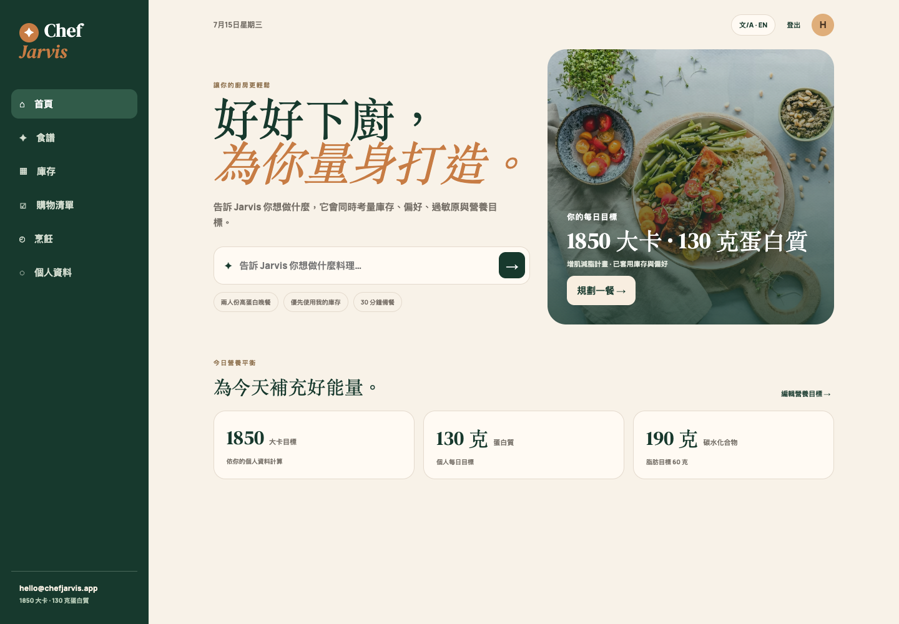
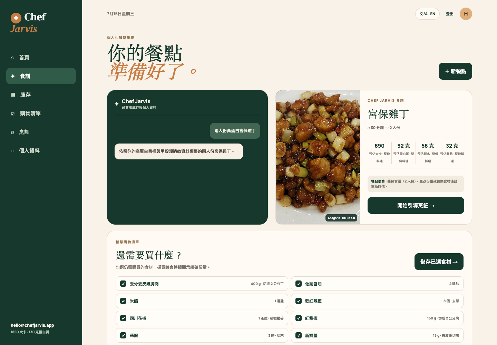
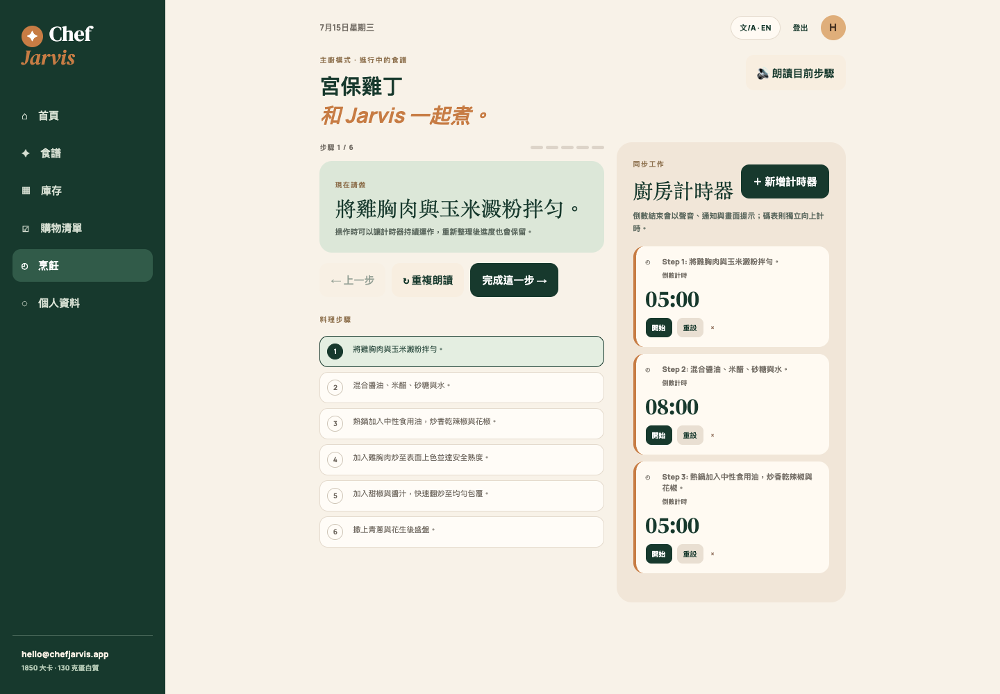

# Chef Jarvis

Chef Jarvis is a personalized AI cooking companion that turns a meal idea into a complete cooking workflow: a profile-aware recipe, a checkable grocery list, healthy ingredient substitutions, guided cooking steps, and independent kitchen timers.

**Live app:** [chef-jarvis.pages.dev](https://chef-jarvis.pages.dev)

## Why Chef Jarvis

Most recipe apps start with a generic recipe. Chef Jarvis starts with the person cooking it.

During onboarding, users set their nutrition target, body goal, allergies, dietary needs, dislikes, and available kitchen equipment. Every plan is then designed around that profile.

Its primary product principle is **personalized healthy swaps**:

- Recomposition / fat-loss users get leaner, higher-protein alternatives.
- Muscle-gain users receive protein-forward portion suggestions.
- Lactose intolerance, gluten-free needs, and common food allergies are carried into every plan.
- Users can select a suggested substitute before starting guided cooking.

## Core experience

1. **Create an account and food profile** — body data, calorie/macronutrient targets, health goal, allergies, dietary preferences, dislikes, and kitchen equipment.
2. **Ask for a meal** — enter a dish or a free-form request such as “high-protein Kung Pao chicken for two.”
3. **Receive a personalized plan** — exact purchasable ingredient names, measured quantities, preparation notes, macros, cooking steps, equipment alternatives, and ideas that reuse purchased ingredients.
4. **Build and use a grocery checklist** — save only what is needed, then check off or delete lists from the Shopping page.
5. **Choose healthy swaps** — review profile-safe replacements before cooking.
6. **Cook in Chef Mode** — work through persistent step-by-step instructions with independent countdowns, stopwatches, completion alarms, notifications, and screen wake lock.
7. **Verify nutrition** — USDA FoodData Central reference values load in the background so the recipe is usable immediately.

## Feature set

| Area                | Included capabilities                                                                                                          |
| ------------------- | ------------------------------------------------------------------------------------------------------------------------------ |
| Personalization     | Macro target calculator or custom targets, body-composition goals, allergies, dietary preferences, dislikes, equipment profile |
| AI meal planning    | Gemini-powered bilingual plan using the server-verified profile and pantry, with strict validation and per-user quotas         |
| Smart swaps         | Fat-loss, recomposition, muscle-gain, lactose-free, gluten-free, nut-safe, and shellfish-safe alternatives                     |
| Grocery planning    | Checkable, separately listed ingredients with exact units and a dedicated page for persistent shopping lists                   |
| Chef Mode           | Persistent guided steps, language-aware speech, parallel timers, completion alerts, notifications, and wake lock               |
| Pantry and planning | Pantry inventory, saved meal cards, ingredient-reuse ideas for later meal planning                                             |
| Nutrition           | USDA FoodData Central ingredient reference data, loaded after the plan so it does not block the user                           |
| Language and images | English / Traditional Chinese UI plus exact, representative, or curated Wikimedia imagery with explicit attribution           |
| Privacy and control | JSON data export, published retention policy, and permanent authenticated account deletion                                      |

## Product preview

| Personalized home                                                                 | Exact recipe and grocery list                                                              | Guided Chef Mode                                                                  |
| --------------------------------------------------------------------------------- | ------------------------------------------------------------------------------------------ | --------------------------------------------------------------------------------- |
|  |  |  |

## Architecture

```text
Cloudflare Pages
  └─ Static web client
       ├─ Supabase Auth
       ├─ Supabase Postgres + RLS
       └─ Supabase Edge Functions
            ├─ chef-meal-plan → Gemini API
            ├─ chef-usda-nutrition → USDA FoodData Central API
            └─ chef-delete-account → Supabase Auth administration
```

### Security model

- The browser only contains the Supabase **publishable** key.
- Gemini and USDA credentials are server-side Supabase Edge Function secrets.
- All product Edge Functions verify a valid Supabase user JWT.
- User-owned data is protected with Supabase Row Level Security.
- Account deletion uses the service role only inside the deletion Edge Function;
  database foreign keys then cascade deletion through linked product data.

## Repository structure

```text
public/                         Cloudflare Pages static web app
  app.js                        Auth, shell, profile, and pantry UI
  chef-mode.js                  Planning, shopping, guided cooking, and one timer loop
  domain.js                     Tested nutrition and timer domain functions
  *.css                         Readable visual system and feature styles
supabase/functions/
  chef-meal-plan/               Authenticated Gemini meal-plan endpoint
  chef-usda-nutrition/          Authenticated USDA nutrition endpoint
  chef-delete-account/          Authenticated permanent account deletion
supabase/migrations/            Schema, RLS, cascades, grants, and quota functions
tests/                          Node domain and source-contract tests
e2e/                            Playwright public and authenticated smoke tests
PRIVACY.md                      Privacy and data-retention policy
```

## Local development

This project is currently a dependency-light static app. Serve `public/` with any local static server, then sign in with a test Supabase account.

```bash
npm run serve
```

Run the local checks before deploying:

```bash
npm test
npm run check
npm run test:e2e
```

The deployed client calls these Supabase functions:

```text
POST /functions/v1/chef-meal-plan
POST /functions/v1/chef-usda-nutrition
POST /functions/v1/chef-delete-account
```

Requests require the signed-in user’s access token and the project publishable
key. Account deletion additionally requires the exact confirmation value
`DELETE`.

The public Playwright flow always runs. Authenticated view and route-mocked
named-recipe coverage runs when a dedicated, completed-onboarding account is
supplied:

```bash
CHEF_E2E_EMAIL=<test-account> \
CHEF_E2E_PASSWORD=<test-password> \
npm run test:e2e
```

The named-recipe stories mock the meal-plan and nutrition Edge routes and fail
if generation attempts to write a recipe. When either credential is absent,
Playwright reports the authenticated stories as explicit skips. Use only a
disposable test account for any future E2E that intentionally mutates cloud
data.

## Required Supabase Edge Function secrets

Set these in **Supabase Dashboard → Edge Functions → Secrets**. Do not place them in frontend code or commit them to Git.

```bash
npx supabase secrets set GEMINI_API_KEY=<Google-AI-Studio-key>
npx supabase secrets set USDA_FDC_API_KEY=<USDA-FoodData-Central-key>
npx supabase secrets set ALLOWED_ORIGINS=https://chef-jarvis.pages.dev,https://your-preview.example
npx supabase secrets set THEMEALDB_API_KEY=<supporter-key>
npx supabase secrets set THEMEALDB_PERSISTENCE_POLICY=session_only
```

Supabase-provided runtime variables (`SUPABASE_URL`, `SUPABASE_ANON_KEY`, and `SUPABASE_SERVICE_ROLE_KEY`) are read by the functions. The service role never leaves the server; it is used to read the authenticated user’s profile and pantry and to consume the internal quota RPC.

### TheMealDB storage and licensing gate

`session_only` is the safe default. A sourced recipe can be displayed and
cooked in the current tab, but its complete translated or adapted content is
not inserted into `recipes`, reused in saved plans, or restored after the
session ends.

Set `THEMEALDB_PERSISTENCE_POLICY=permanent` only after a written license review
confirms the production account has storage, translation, adaptation, and
replay rights. Record that approval in the release evidence before changing the
secret. The public development key `1` is for development access and is not the
production configuration; production must use the approved supporter key.

### Named-recipe behavior and observability

A recognizable named-dish request has only three valid browser outcomes:

- the same dish is returned from an external recipe adapted to the user, with
  source attribution and the configured persistence policy;
- the same dish is generated by Gemini and labeled as AI-generated; or
- the app asks for clarification or returns
  `code: "named_recipe_unavailable"` with the original dish-specific message.

Named requests never enter the broad-request fallback rotation. Broad prompts
can still use the clearly labeled measured fallback when generation is
unavailable.

The Edge logs use structured events:

- `chef_dish_resolution`: `request_id`, `model`, `outcome`, `duration_ms`;
- `chef_recipe_provider`: `request_id`, hashed `dish_key`, `provider`,
  `outcome` (`external_recipe`, `provider_miss`,
  `provider_recipe_incomplete`, or `provider_unavailable`), `duration_ms`;
- `chef_recipe_validation` and `chef_recipe_generation`: `request_id`,
  `dish_key`, model attempt, disposition or outcome, and elapsed time;
- `chef_meal_plan_completed`: final outcome, request ID, total duration, and
  safe summary fields such as prompt version or whether an image was found.

Logs must not contain access tokens, API keys, raw profiles or allergies, full
provider payloads, prompts, or complete recipe content.

## Applying Supabase changes

Link the local folder to the intended Supabase project, inspect the pending migration, then apply and deploy it before the updated meal-plan function:

```bash
npx supabase link --project-ref <project-ref>
npx supabase db push
npx supabase functions deploy chef-meal-plan
npx supabase functions deploy chef-usda-nutrition
npx supabase functions deploy chef-delete-account
```

The meal-plan quota defaults to 5 requests per minute and 100 per rolling 24 hours per user.

## Deploying to Cloudflare Pages

The current production deployment is on Cloudflare Pages.

```bash
npx wrangler pages deploy public --project-name chef-jarvis --branch main
```

Cloudflare authentication is required locally. Supabase Edge Functions are deployed separately from the Supabase project.

After both Cloudflare and Supabase deployment, verify that the deployed frontend
hashes and Edge Function versions match the working tree without consuming
Gemini or USDA quota:

```bash
npm run verify:deployment
```

See [`docs/RELEASE_REVIEW.md`](docs/RELEASE_REVIEW.md) for the complete release
gate and required credentials.

Before each named-recipe release, the disposable-account smoke evidence must
cover all of the following:

1. A known TheMealDB dish renders exact source attribution and, under
   `session_only`, creates no recipe row.
2. A provider miss returns the exact named dish through Gemini rather than an
   unrelated fallback.
3. An ambiguous name shows candidates; the selected label is resubmitted
   exactly and the clarification itself creates no recipe.
4. A custom name with no safe candidate asks for ingredients or cooking
   details and renders no recipe.
5. A forced provider/model failure preserves the original dish-specific 503,
   creates no plan or image, and refunds any consumed generation quota.
6. A broad request can still use the labeled broad fallback.

## Product notes

- USDA values are references per 100 g. Final recipe nutrition varies by brand, portion, and cooking oil.
- Healthy swaps are guidance, not medical advice. Users with severe allergies should still check product labels.
- Legacy recipes or shopping lists without exact quantities remain readable,
  but cannot start guided cooking, create a new grocery list, or update pantry
  until regenerated as a measured recipe.
- Offline support covers the cached shell and local cooking progress. Sign-in,
  cloud sync, meal planning, and nutrition references need a connection; the
  UI displays this scope whenever the browser is offline.
- Broad Wikimedia fallback results are labeled as representative dish images;
  they are never presented as an exact photo of the generated recipe.
- The design is web-first but the system boundaries also support a future App Store client using the same Supabase backend and Edge Functions.

## License

Private — all rights reserved.
